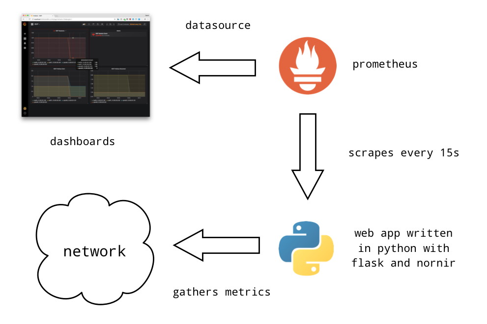
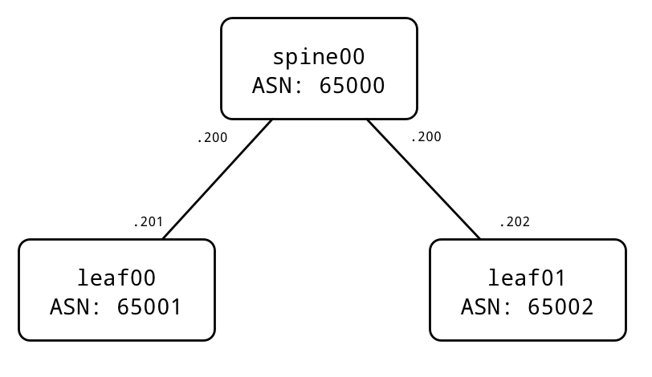
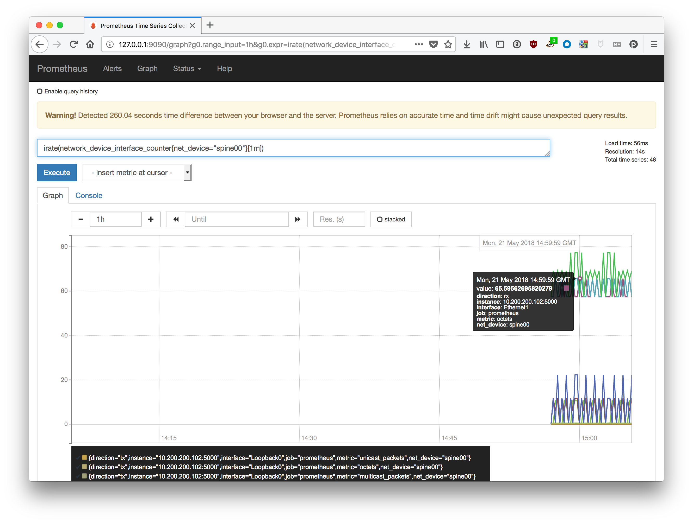
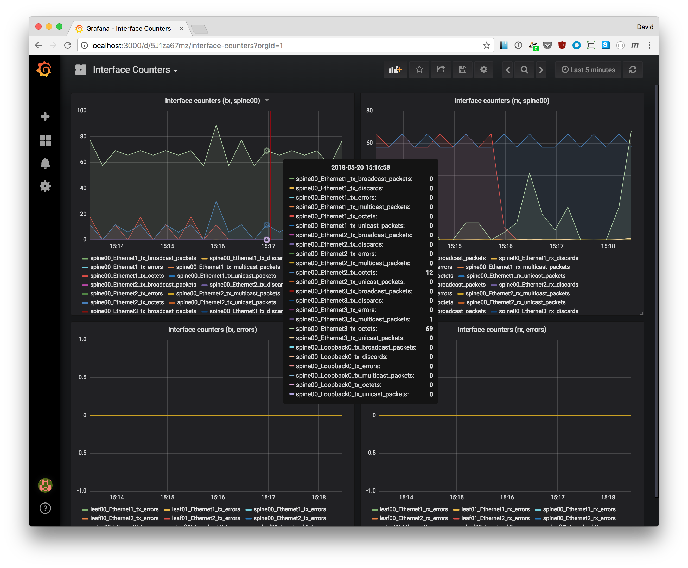
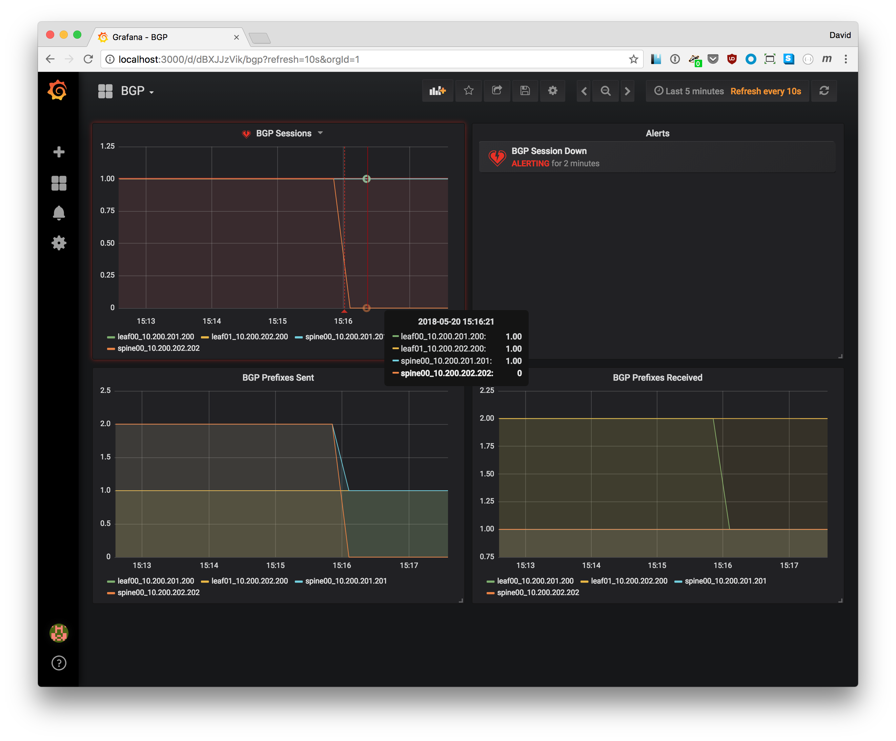

# Network telemetry: from SNMP to prometheus

Whether you just don't like SNMP or you want to leverage the same tooling for monitoring and alerting as the rest of your organization, this "tutorial" has you covered. What we are going to do is see how we can monitor our network infrastructure with [prometheus](https://prometheus.io/) and [grafana](https://grafana.com/).

In this blogpost we are going to see how to build a webapp using [flask](http://flask.pocoo.org/)+[nornir](https://github.com/nornir-automation/nornir) that gathers metrics from the network and presents it via a web application. Then we will scrape that web application with prometheus to store those metrics and finally we will see how we can present those metrics with grafana. In summary, you will learn how to replace your old-fashioned SNMP monitoring system with a next-generation-12-factor-app-compliant-telemetry-system.

## Components

Let's start by introducing the components involved:

* [grafana](https://grafana.com/) - According to their webpage grafana is "the open platform for beautiful analytics and monitoring". It can take many different sources as input and alert based on events, create dashboards to present the many metrics of your system, etc.
* [prometheus](https://prometheus.io/) - From their documentation "Prometheus scrapes metrics from instrumented jobs, either directly or via an intermediary push gateway for short-lived jobs. It stores all scraped samples locally and runs rules over this data to either aggregate and record new time series from existing data or generate alerts. Grafana or other API consumers can be used to visualize the collected data."
* [nornir](https://github.com/nornir-automation/nornir) - Nornir is a pluggable multi-threaded framework with inventory management to help operate collections of devices. We are going to use it to gather the metrics we will want to scrape with `prometheus`
* [flask](http://flask.pocoo.org/) - Flask is a python framework to build web applications. We will basically present to prometheus all the data gathered by `nornir` via a flask web application. Because both `nornir` and `flask` are python frameworks they will integrate seamlessly as a single application.

Here is a diagram to try to make things clearer:

The network itself looks like this:

They are all running cEOS (containerized version of EOS) although we won't care much about that as `nornir` will be using [napalm](http://napalm.readthedocs.io/) under the hoods so the OS will be abstracted away from us.

## Requirements

You can run this demo yourself, however, you will need a couple of things:

* `docker` and `docker-compose`.
* `ceosimage:4.20.5F` which can be downloaded for free [here](https://www.arista.com/en/support/software-download) (requires registration)

## Project structure

This "tutorial" is not going to go super deep into the details, instead, it's going to focus on laying out the foundation and will be up to the reader to go deeper into the parts they are most interested in. Because of that, we are going to start by describing the project structure so you know where to look at if you want to look into the details:

* [./grafana/](grafana) - Configuration for grafana (it's in binary so not much to look at)
* [./monit/](monit) - Python application using nornir+flask to gather and present the metrics to prometheus
* [./network/](network) - Starting configuration for the network
* [./prometheus/](prometheus) - Configuration for prometheus
* [./Makefile](Makefile) - We are to express the `make` operations here.

## Starting the environment

All the components will run on different containers so you don't have to worry about the environment. Just start everything by executing:

	make start

Now wait a couple of minutes to make sure all the software gets properly initialized. You can connect to any of the devices available with `make {spine00,leaf00,leaf01}`.

I'd suggest by connecting to `spine00` and check if BGP is up and running. If BGP is not up you may have to connect to `spine00` and swap the IPs in `Et1` and `Et2` because docker sometimes doesn't respect the order of the interfaces.

When you are done you can stop the environment executing the command:

	make stop

# Gathering and presenting metrics

Let's start by looking at the metrics being exported by clicking [here](http://127.0.0.1:5000/metrics). You should see something like this:

	network_device_interface_counter {net_device="spine00", interface="Ethernet2", direction="tx", metric="octets"} 5974
	network_device_interface_counter {net_device="spine00", interface="Ethernet2", direction="rx", metric="octets"} 34467
	network_device_interface_counter {net_device="spine00", interface="Ethernet2", direction="tx", metric="unicast_packets"} 29
	network_device_interface_counter {net_device="spine00", interface="Ethernet2", direction="rx", metric="unicast_packets"} 3
	network_device_interface_counter {net_device="spine00", interface="Ethernet2", direction="tx", metric="multicast_packets"} 20
	...

	network_device_interface_counter {net_device="leaf00", interface="Ethernet1", direction="tx", metric="octets"} 6075
	network_device_interface_counter {net_device="leaf00", interface="Ethernet1", direction="rx", metric="octets"} 34946
	network_device_interface_counter {net_device="leaf00", interface="Ethernet1", direction="tx", metric="unicast_packets"} 31
	network_device_interface_counter {net_device="leaf00", interface="Ethernet1", direction="rx", metric="unicast_packets"} 1
	...

	bgp_session_up {net_device="leaf00", peer="10.200.201.200"} 1
	bgp_prefixes {net_device="leaf00", peer="10.200.201.200", metric="sent_prefixes"} 1
	bgp_prefixes {net_device="leaf00", peer="10.200.201.200", metric="received_prefixes"} 2
	...

Those metrics are generated on the fly every time the page is loaded. Prometheus will be querying this endpoint every 15s and scraping the metrics capturing metrics from our network in near real time.

If you want to take a look at the code needed to generate that page you can check the [monit.py](monit/monit.py) script. Code is commented and shouldn't be too scary if you know python. If you do, sufficient is to say the code looks more daunting than it actually is due to the data transformations needed to accommodate prometheus metrics format. The interesting bits are in the functions `metrics` and `_get_metrics` as those show how `flask` and `nornir` integrate seamlessly to build this web application.

Note: If you see an error when querying the metrics yourself every now and then don't sweat. For simplicity we are not using `gunicorn` or any other application server, we are just starting the flask appliation directly. This means only one query at a time is possible you probably crossed the streams with prometheus. In a production environment you'd just place an application server on top of the flask application and this problem would be gone.

# Querying the metrics

Now that we have seen the endpoint, we can connect to prometheus and start playing with the metrics [here](http://127.0.0.1:9090/graph). There you can query the data and see some graphs. For instance:

Note: If you are trying to follow this "tutorial" yourself I'd suggest making sure it's been ~5-10 minutes since you started the environment to make sure the system has enough data to return meaningful stuff. If you can't see any data check the [targets](http://127.0.0.1:9090/targets) are all `UP`. If they are and the previous step looked good wait a few more minutes. If they are not `UP` there is something wrong.

# Dashboards

As we mentioned earlier, we are going to use grafana for visualization and alerting. You can connect to it [here](http://localhost:3000) with user and password `admin` and `admin` respectively. Now, if you click in `Home` you will see under `General` there are a few dashboards already created:

* Interface Counters

* BGP

Note that on the image below we are getting alerts because one of the BGP sessions is failing

At this point, I'd suggest playing a bit with the network and try things like:

1. Adding/Removing prefixes from BGP
2. Shutting down interface to see how fast grafana will start showing the alert as compared to other SNMP-based monitoring sytems
3. Playing with the dashboards to see how flexible they are thanks to prometheus query language you can use in the panels.

Note that dashboards can be exported/imported in YAML format, which means that one you have created a "master" dashboard you like you should be able to use it as a template for future uses.
